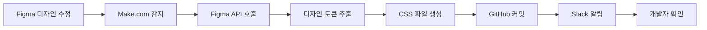

# PawStars Figma Integration

Figma 디자인을 자동으로 코드에 반영하는 통합 시스템입니다.

## 🚀 주요 기능

- **실시간 디자인 동기화**: Figma 파일 변경 시 자동으로 코드 업데이트
- **디자인 토큰 추출**: 색상, 폰트, 간격 등을 CSS 변수로 자동 생성
- **컴포넌트 스타일**: Figma 컴포넌트를 CSS 클래스로 변환
- **자동 커밋**: GitHub에 자동으로 변경사항 커밋
- **팀 알림**: Slack으로 업데이트 알림

## 📋 설정 방법

### 1. Figma 설정

1. **Figma Personal Access Token 생성**
   - Figma → Settings → Account → Personal access tokens
   - "Generate new token" 클릭
   - 토큰을 안전한 곳에 저장

2. **Figma File Key 확인**
   - Figma 파일 URL에서 추출: `https://www.figma.com/file/{FILE_KEY}/...`

### 2. Make.com 설정

1. **Make.com 계정 생성** (make.com)
2. **새 시나리오 생성**
3. **Figma 모듈 추가**
   - "Watch File" 트리거 설정
   - Figma 계정 연결
4. **GitHub 모듈 추가**
   - "Create/Update File" 액션 설정
   - GitHub 계정 연결

### 3. 환경 변수 설정

```bash
# env.example을 복사하여 .env 파일 생성
cp figma-integration/env.example figma-integration/.env

# 실제 값으로 수정
nano figma-integration/.env
```

### 4. 의존성 설치

```bash
cd figma-integration
npm install
```

## 🔧 사용 방법

### 수동 실행

```bash
# 디자인 토큰 생성
node generate-tokens.js

# 특정 컴포넌트만 업데이트
node generate-tokens.js --components="Button,Card,Input"
```

### 자동 실행 (Make.com)

1. Figma에서 디자인 수정
2. Make.com이 자동으로 감지
3. 디자인 토큰 업데이트
4. GitHub에 자동 커밋
5. 팀에 Slack 알림

## 📁 생성되는 파일

```
src/styles/
├── figma-tokens.css          # 디자인 토큰 (색상, 폰트 등)
├── figma-components.css      # 컴포넌트 스타일
└── figma-utilities.css       # 유틸리티 클래스
```

## 🎨 디자인 토큰 예시

```css
:root {
  /* 색상 */
  --color-primary: rgba(255, 107, 107, 1);
  --color-secondary: rgba(78, 205, 196, 1);
  --color-background: rgba(0, 0, 0, 1);
  --color-text: rgba(255, 255, 255, 1);
  
  /* 폰트 */
  --font-heading-size: 24px;
  --font-heading-weight: 700;
  --font-body-size: 16px;
  --font-body-weight: 400;
  
  /* 간격 */
  --spacing-xs: 4px;
  --spacing-sm: 8px;
  --spacing-md: 16px;
  --spacing-lg: 24px;
  --spacing-xl: 32px;
  
  /* 그림자 */
  --shadow-card: 0px 4px 16px rgba(0, 0, 0, 0.1);
  --shadow-button: 0px 2px 8px rgba(0, 0, 0, 0.15);
}
```

## 🔄 워크플로우



## 🛠 고급 설정

### 커스텀 매핑

특정 Figma 스타일을 커스텀 CSS 속성으로 매핑:

```javascript
// figma-api.js에서 수정
const customMappings = {
  'Primary Button': '--btn-primary-bg',
  'Secondary Button': '--btn-secondary-bg',
  'Card Shadow': '--card-shadow'
};
```

### 조건부 업데이트

특정 조건에서만 업데이트:

```javascript
// 특정 페이지만 감시
const watchPages = ['Mobile', 'Desktop', 'Components'];

// 특정 컴포넌트만 추출
const includeComponents = ['Button', 'Card', 'Input', 'Modal'];
```

## 🚨 주의사항

1. **API 제한**: Figma API는 시간당 요청 제한이 있습니다
2. **토큰 보안**: Access Token을 공개 저장소에 커밋하지 마세요
3. **파일 충돌**: 자동 생성된 CSS 파일을 수동으로 수정하지 마세요
4. **백업**: 중요한 변경 전에는 백업을 생성하세요

## 📞 지원

문제가 발생하면 다음을 확인하세요:

1. Figma Access Token이 유효한지
2. File Key가 올바른지
3. Make.com 시나리오가 활성화되어 있는지
4. GitHub 권한이 충분한지

## 🔗 참고 링크

- [Figma API 문서](https://www.figma.com/developers/api)
- [Make.com 가이드](https://www.make.com/en/help)
- [디자인 토큰 가이드](https://designtokens.org/)

